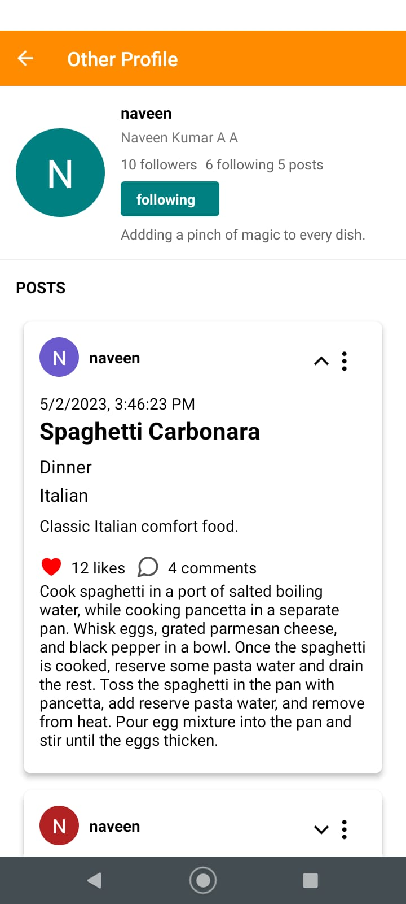
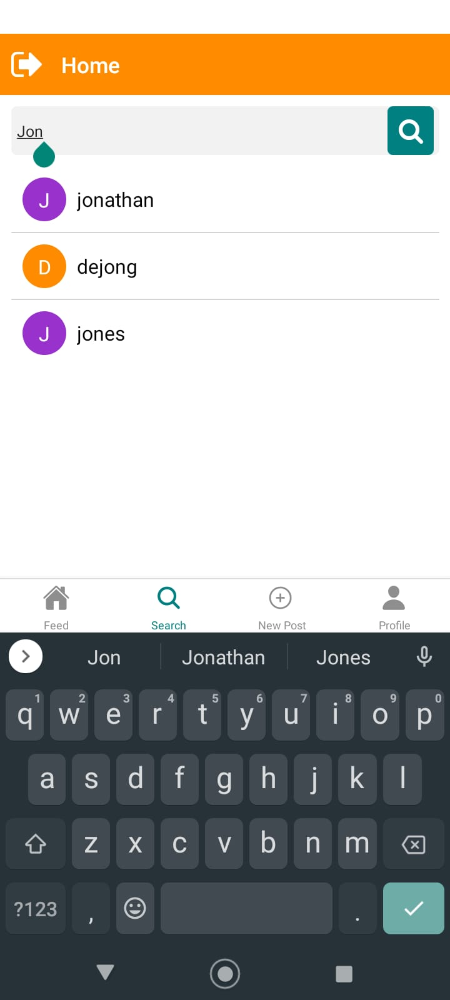

# Cooking-Community-Android

Cooking Community is a mobile application that allows users to create an account and log in securely to access various features related to cooking. Users can create and delete recipes, filter posts based on meal type, like and comment on other users' posts, save posts to their profile for future reference, search for other users, and visit other users' profiles to follow or unfollow them. The app also includes an option to edit the user's own profile. With features like secure authentication and protection against SQL injection and cross-site scripting, Cooking Community provides a safe and engaging environment for users to share their love for cooking and connect with like-minded individuals.

To run the app in development environment, follow these steps:

-> Install the Expo CLI globally by running the following command in the terminal:
npm install -g expo-cli
-> Clone the project from the Git repository to your local machine.
-> Open a terminal window and navigate to the project directory.
-> Install the dependencies by running the following command:
npm install
-> Start the Expo development server by running the following command:
npm start
-> This will start the Metro Bundler and display a QR code in the terminal.
-> Install the Expo Go app on your Android or iOS device from the respective app stores.
-> Open the Expo Go app and scan the QR code displayed in the terminal.
-> This will launch the app on your mobile device and you can start testing and developing the app.

Note: For iOS devices, you may need to have a Mac computer and Xcode installed to run the app in the development environment.

steps to install the app using the apk:

-> Download the apk file from the project repository at v1.0.0/cooking_community.apk.
-> On your Android device, go to Settings > Security > Unknown sources and enable installation from unknown sources.
-> Use a file manager app to locate the downloaded apk file on your device and tap on it to start the installation.
-> Follow the on-screen instructions to complete the installation process.
-> Once the installation is complete, open the app and start using it.

Cooking Community Version 1.0.0 Release Notes:

We're excited to announce the launch of Cooking Community, a social platform for food enthusiasts to share, discover, and save their favorite recipes!

Features:

-> Create an account or sign in with an authenticated login
-> Secure features to prevent SQL injection and cross-site scripting attacks
-> Create, delete and search recipes with filters based on meal type
-> Like, comment on and save recipes to your profile for easy later reference
-> Search for other users and visit their profiles
-> Follow or unfollow other users and edit your own profile

Technical details:

-> Built using React Native version 0.71.7
-> Node version 14.16.1 was used during development
-> SQL injection and cross-site scripting protection has been implemented for added security
-> We used Expo SDK version 48.0.15 for development
-> Other notable packages used include @react-navigation, @react-native-elements, @react-native-async-storage, and axios

Thank you for using Cooking Community! We hope you enjoy sharing and discovering new recipes with our platform.

